# Optimized Processing Timeline
## Mon Rovîa Campaign - Parallel Scene Generation

```mermaid
gantt
    title Baby Podcast Generation Timeline
    dateFormat X
    axisFormat %M:%S
    
    section Scene Parsing
    Parse JSON Input          :milestone, input,  0,   0
    Validate & Queue Scenes   :           parse,  0,   30
    
    section Audio Generation
    Baby 1 - Scene 0 Audio    :           b1s0,   30,  60
    Baby 1 - Scene 2 Audio    :           b1s2,   60,  90
    Baby 1 - Scene 5 Audio    :           b1s5,   90,  120
    Baby 2 - Scene 1 Audio    :           b2s1,   30,  60
    Baby 2 - Scene 4 Audio    :           b2s4,   60,  90
    Baby 2 - Scene 6 Audio    :           b2s6,   90,  120
    
    section Image Generation
    Baby 1 Image Generation   :           img1,   30,  90
    Baby 2 Image Generation   :           img2,   30,  90
    
    section Media Processing
    Mon Rovîa Clip Processing :           media,  30,  120
    Visual Overlay Creation   :           overlay, 90, 150
    
    section Video Generation
    Scene 0 - Baby 1 Video    :           vid0,   120, 300
    Scene 1 - Baby 2 Video    :           vid1,   120, 300
    Scene 2 - Baby 1 Video    :           vid2,   150, 330
    Scene 3 - Media Video     :           vid3,   180, 240
    Scene 4 - Baby 2 Video    :           vid4,   180, 360
    Scene 5 - Baby 1 Video    :           vid5,   210, 390
    Scene 6 - Baby 2 Video    :           vid6,   240, 420
    
    section Assembly
    Collect All Videos        :milestone, collect, 420, 420
    Stitch Scenes Together    :           stitch, 420, 540
    Add Background Audio      :           bgaudio, 540, 600
    Final Rendering           :           render, 600, 720
    
    section Distribution
    Campaign Complete         :milestone, complete, 720, 720
    Upload to YouTube         :           youtube, 720, 780
    Save to Google Drive      :           drive,  720, 750
    Generate Social Clips     :           social, 720, 780
```

## Processing Optimization Benefits

### **Parallel Processing Advantages:**
- **Audio Generation**: All 7 audio tracks generated simultaneously
- **Image Generation**: Both baby images created in parallel  
- **Video Processing**: Multiple Hedra API calls running concurrently
- **Total Time Savings**: ~40% reduction vs sequential processing

### **Resource Management:**
- **Memory Usage**: Efficient asset reuse (baby images)
- **API Rate Limits**: Intelligent queuing and retry logic
- **Error Recovery**: Individual scene failures don't stop entire campaign

### **Timeline Breakdown:**
1. **Minutes 0-2**: Input validation and scene parsing
2. **Minutes 2-4**: Parallel audio/image/media generation
3. **Minutes 4-7**: Concurrent video generation (longest step)
4. **Minutes 7-8**: Assembly and final rendering
5. **Minutes 8-9**: Multi-platform distribution

### **Critical Path Optimization:**
- **Bottleneck**: Hedra AI video generation (~3 minutes per scene)
- **Solution**: Process videos in parallel, limited by API concurrency
- **Expected Total Time**: 8-10 minutes for 7-scene campaign